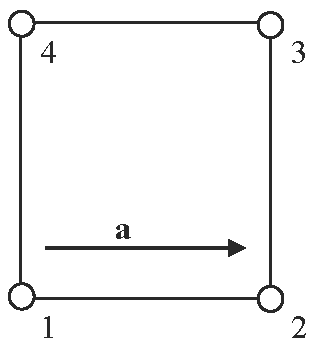

# local

**Module:** core

**Category:** vec3dvaluator

**Type string:** `"local"`

## Parameters

| Name | Description | Default | Range | Units |
|------|-------------|---------|-------|-------|
| `local` | local |  | $\in \mathbb{Z}$ |  |


## Description

This valuator generates a vector using the local node numbering in an element. The `local` parameter is interpreted as the local node numbers of the nodes that define the direction of vector.

The following example defines a vector for the fiber property by local element nodes 1 and 2. This option is very useful when the vector field can be interpreted as following one of the mesh edges.

```
<fiber type="local">1,2</fiber>
```


/// figure-caption
Illustration for the `local` vector valuator.
///

