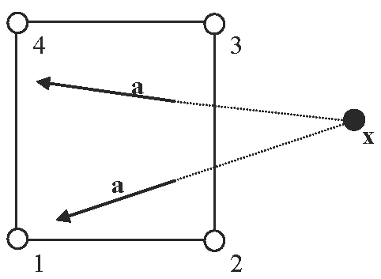

# spherical

**Module:** core

**Category:** vec3dvaluator

**Type string:** `"spherical"`

## Parameters

| Name | Description | Default | Range | Units |
|------|-------------|---------|-------|-------|
| `center` | center | {0.000000,0.000000,0.000000} | $\in \mathbb{R}^3$ |  |
| `vector` | vector | {1.000000,0.000000,0.000000} | $\in \mathbb{R}^3$ |  |


## Description

This valuator generates a unit vector where the orientation is determined by a point in space and the global location of each element integration point. 

The following example defines a spherical fiber distribution centered at $(0,0,1)$:
```
<fiber type="spherical">0,0,1</fiber>
```


/// figure-caption
Illustration for the `spherical` vector valuator.
///
