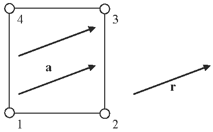

# vector

**Module:** core

**Category:** vec3dvaluator

**Type string:** `"vector"`

## Parameters

| Name | Description | Default | Range | Units |
|------|-------------|---------|-------|-------|
| `vector` | vector | {0.000000,0.000000,0.000000} | $\in \mathbb{R}^3$ |  |


## Description

The valuator always returns a constant vector, defined by the `vector` parameter. 

The following example defines all element fiber directions in the direction of the vector $(1,0,0)$: 

```
<fiber type="vector">1,0,0</fiber>
```


/// figure-caption
Illustration for the `vector` vector valuator.
///

