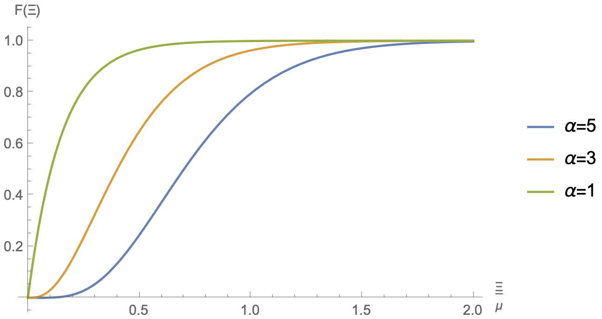

# CDF gamma

**Module:** solid

**Category:** materialprop

**Type string:** `"CDF gamma"`

## Parameters

| Name | Description | Default | Range | Units |
|------|-------------|---------|-------|-------|
| `Dmax` | Dmax | 1 | $[0, 1]$ |  |
| `alpha` | alpha | 2 | $\gt 0$ |  |
| `mu` | mu | 4 | $\ge 0$ |  |


## Description

The material type for a gamma c.d.f. is `CDF gamma`.

For this material the c.d.f. is given by

\[
F\left(\Xi\right)=\frac{\gamma\left(\alpha,\Xi/\mu\right)}{\Gamma\left(\alpha,0\right)}\,,
\]

where $\gamma\left(\alpha,z\right)$ and $\Gamma\left(\alpha,z\right)$ are the lower and upper incomplete gamma functions, respectively. The normalization by $\Gamma\left(\alpha,0\right)$ ensures that this function is bounded by $0\le F\left(\Xi\right)\le1$. The figure below uses $\mu=0.15$.


/// figure-caption
Illustration of the `CDF gamma` cumulative distribution function.
///

_Example:_
```xml
<damage type="CDF gamma">
  <alpha>3</alpha>
  <mu>0.15</mu>
</damage>
```
