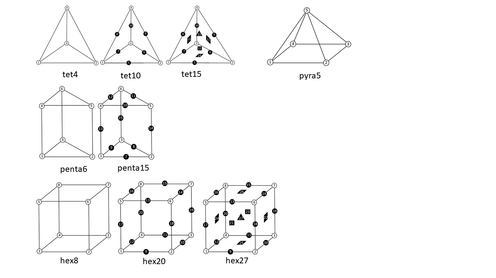
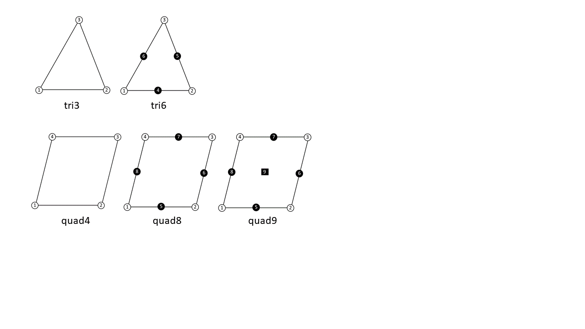

# 3.6 Mesh Section {: #sec:Geometry-Section }

The _Mesh_ section contains all the mesh data, including nodal coordinates and element connectivity. It has the following sub-sections:

**Nodes** defines the nodal coordinates of the mesh

**Elements** defines the elements of the mesh. If the name attribute is provided, then this also defines an element set. Element sets defined this way are also referred to as _parts_.

**NodeSet** defines a node set

**Edge** defines an edge, i.e. a set of line elements

**Surface** defines a surface, i.e. a set of facets

**DiscreteSet** defines a set of discrete elements (e.g. springs)

**ElementSet** defines an element set

**SurfacePair** define a surface pair that can be used by a contact definition.

**PartList** define a named list of parts (i.e. element sets defined via the Elements tag)

At least one _Nodes_ section must be defined and one _Elements_ section. The other sections are optional. The _NodeSet_, _Edge_, _Surface_, _DiscreteSet_, _ElementSet_, _SurfacePair_, and _PartList_ sections define sets of nodes, edges, facets, discrete elements, elements, surface pairs, and part lists, respectively, and can be referenced by other sections of the model file. For instance, boundary conditions can be defined by referencing the sets to which the boundary condition will be applied.

## Nodes Section

The _Nodes_ section contains nodal coordinates. It has an optional attribute called _name_. If this attribute is defined, the _Nodes_ section also defines a node set.

```
<Nodes [name="<set name>"]>
```

The nodes are defined using the _node_ tag which is a child of the _Nodes_ section. Repeat the following XML-element for each node:

```
<node id="n">x,y,z</node>
```

The _id_ attribute is the global identifier of the node and must be a unique number within the model definition. Nodal ids must be defined in increasing order, but do not have to be sequential. This _id_ is used as a reference in the element connectivity section.

Multiple _Nodes_ sections can be defined, but each node can only be defined once. For example:

```
<Nodes name="set01">
  <node id="1">0,0,0</node>
  ...
  <node id="101">1,1,1</node>
</Nodes>
<Nodes name ="set02">
  <node id="102">2,1,1</node>
  ...
  <node id="999">2,2,2</node>
</Nodes>
```

## Elements Section {: #subsec:Elements-Section }

The _Elements_ sections contain a list of the element connectivity data. Multiple _Elements_ sections can be defined. The _Elements_ section has the following attributes.

<div markdown="1" style="display: flex; justify-content: center;">

| **Attribute** | **Description** |
|---|---|
| type | element type |
| name | unique name that identifies this domain |

</div>

Each _Elements_ section contains multiple _elem_ elements that define the element connectivities. Each _elem_ tag has a _id_ attribute that defines the element number. For example, the following _Elements_ section defines a list of hexahedral elements:

```
<Elements type="hex8" name="part1">
  <elem id="1">1,2,3,4,5,6,7,8</elem>
  <elem id="2">9,10,11,12,13,14,15,16</elem>
  ...
</Elements>
```

FEBio classifies elements in three categories, namely _solids, shells__,_ and _beams_.

### Solid Elements {: #subsec:Solid-Elements }

The following solid element types are defined:

<div markdown="1" style="display: flex; justify-content: center;">

| hex8 | 8-node trilinear hexahedral element |
|---|---|
| hex20 | 20-node quadratic hexahedral elements |
| hex27 | 27-node quadratic hexahedral elements |
| penta6 | 6-node linear pentahedral (wedge) element |
| penta15 | 15-node quadratic pentahedral (wedge) element |
| pyra5 | 5-node linear pyramidal element |
| pyra13 | 13-node quadratic pyramidal element |
| tet4 | 4-node linear tetrahedral element |
| tet10 | 10-node quadratic tetrahedral element |
| tet15 | 15-node quadratic tetrahedral element |

</div>

The node numbering has to be defined as in the figure below.

{: style="width:50%; display:block; margin-left:auto; margin-right:auto;" }Node numbering for solid elements

### Shell Elements {: #subsec:Shell-Elements }

FEBio currently supports the following shell elements:

<div markdown="1" style="display: flex; justify-content: center;">

| tri3 | 3-node linear triangular shell element (compatible strain) |
|---|---|
| tri6 | 6-node quadratic triangular shell element (compatible strain) |
| quad4 | 4-node linear quadrilateral shell element (compatible strain) |
| quad8 | 8-node quadratic quadrilateral shell element (compatible strain) |
| quad9 | 9-node quadratic quadrilateral shell element (compatible strain) |
| q4ans | 4-node linear quadrilateral shell element (assumed natural strain) |
| q4eas | 4-node linear quadrilateral shell element (enhanced assumed strain) |

</div>

For shell elements that use a _compatible strain_ formulation, the calculation of strain components is based on nodal displacements, similar to hexahedral or pentrahedral elements. Users should be aware that this compatible strain formulation is very susceptible to element locking when the shell thickness is much smaller than the shell size (e.g., when the aspect ratio is less than 0.01). Therefore, these shell formulations should be used with caution, keeping in mind this important constraint. Conversely, these shell elements perform very well when they are attached to solid elements (e.g., skin over muscle), or sandwiched between shell elements (e.g., cell membrane separating cytoplasm from extra-cellular matrix), as described in [^3.6-1].

{: style="width:75%; display:block; margin-left:auto; margin-right:auto;" }Node numbering for shell elements

The element-locking limitation of compatible strain shell formulations has motivated the development of specialized shell formulations that attempt to overcome locking. The FE literature on this subject is rather extensive and we refer the reader to the excellent review chapter by Bischoff et al. [^3.6-2] on this topic. Methods for overcoming locking include the assumed natural strain (ANS) formulation for transverse shear strains [^3.6-3][^3.6-4] and transverse normal strains [^3.6-5][^3.6-6]. The ANS formulation may be supplemented with the enhanced assumed strain (EAS) method [^3.6-7] and extended to large deformations [^3.6-8][^3.6-9][^3.6-10]. FEBio includes the ANS (_q4ans_) and EAS (_q4eas_) quadrilateral shell element formulations of Vu-Quoc and Tan [^3.6-9], using a seven-parameter EAS interpolation, which is otherwise substantially similar to the five-parameter interpolation presented in an earlier study by Klinkel et al. [^3.6-8]. These shell elements are not suitable for attachment to a solid element, nor sandwiching between two solid elements. Since they don't experience element locking, they should be loaded more slowly than compatible strain shell elements. The most accurate of these shell formulation is _q4eas_.

By default, the nodes of a shell element define its _top_ face. The location of the shell element _bottom_ face is calculated from the nodal values of the shell thickness, along the opposite direction of nodal normals. The nodal normal is evaluated by averaging the top face normal of all shell elements sharing that node. When a shell element is attached to a solid element (e.g., when the shell nodes also represent the nodes of one face of the solid element), FEBio automatically accounts for the shell thickness, reducing the height of the solid element in the direction of the shell normal. It is the user's responsibility to ensure that the shell thickness is less than that of the solid element; otherwise, a negative Jacobian error will be automatically generated.

Prior to FEBio 2.6, the nodes of a shell element defined its _middle_ face (halfway between top and bottom, such that the shell element extends above and below the face defined by the shell nodes). This older formulation can be recovered by setting _shell_formulation _to 0 in the_ Control_ section. This setting only works with compatible strain shell formulations.

By default, stresses and strains reported for a shell element are evaluated by averaging all the integration point values within the shell element, thus producing values that reflect the response along the middle surface. To display shell stresses or strains at the top or bottom faces, use plot variables that start with 'shell top...' or 'shell bottom...', such as 'shell top stress' or 'shell bottom nodal strain'.

When shell domains intersect such that three or more shell elements share the same edge, as in a T-connection, users should set _shell_normal_nodal_ to 0 in the _ShellDomain_ section. This setting ensures that the bottom face of a shell element is calculated using the top face normal, instead of nodal normals, since the latter would be ill-defined for nodes belonging to such an edge.

Finally, please note that shell elements cannot be stacked in FEBio.

### Beam Elements

FEBio supports some truss and beam element formulations. Currently, only linear trusses and linear and quadratic beam elements are supported.

<div markdown="1" style="display: flex; justify-content: center;">

| line2 | 2-node linear truss or beam element |
|---|---|
| line3 | 3-node quadratic beam element |

</div>

Whether a truss or beam formulation is used, is determined in the corresponding BeamDomain section.

## NodeSet Section {: #subsec:NodeSet-Section }

The _NodeSet_ section allows users to define node sets. These node sets can then later be used in the definition of boundary conditions and loads. A node set is defined by the _NodeSet_ tag. This tag takes one required attribute, _name_, which defines the name of the node set. A node set definition is followed by a list of node IDs. For example,

```
<NodeSet name="nodeset1">1, 2, 101, 102</NodeSet>
```

For larger nodesets, it is recommended to split the list across several lines.

```
<NodeSet name="nodeset1">
   1, 2, 3, 4,
   5, 6, 7, 8,
   9, 10, 11, 12
</NodeSet>

```

## Edge Section {: #subsec:Edge-Section }

The _Edge_ section allows users to define a set of edges. These edges can be used to define boundary conditions or loads.

```
<Edge name="edge1">
  <line2 lid="1">1,2</line2>
  <line2 lid="2">2,3</line2>
</Edge>
```

Here, the _lid_ attribute defines the _local_ id of the edge, local with respect to the edge definition. The local ids must begin at 1 and defined sequentially.

The edge elements are defined by using a tag that depends on the type of the edge element. The following edge elements are currently supported.

**_line2_** 2-node line element

**_line3_** 3-node line element

Edges cannot overlap element boundaries and must be a valid edges of elements.

## Surface Section {: #subsec:Surface-Section }

The _Surface_ section allows users to define surfaces. These surfaces can then later be used to define the boundary conditions and contact definitions. A surface definition is followed by a list of surface elements, following the format described below.

```
<Surface name="named_surface">
  <quad4 id="1">1,2,3,4</quad4>
  <...>
</Surface>
```

The _Surface_ takes one required attribute, namely the _name_. This attribute sets the name of the surface. This name will be used later to refer back to this surface.

The following surface elements are available:

**_quad4_** 4-node quadrilateral element

**_quad8_** 8-node serendipity quadrilateral element

**_tri3_** 3-node triangular element

**_tri6_** 6-node quadratic triangular element

**_tri7_** 7-node quadratic triangular element

The value for the surface element is the nodal connectivity:

```
<quad4 id="n">n1,n2,n3,n4</quad4>
<tri3 id="n">n1,n2,n3</tri3>
```

Surface elements cannot overlap element boundaries. That is, the surface element must belong to a specific element. Surface elements do not contribute to the total number of elements in the mesh. They are also not to be confused with shell elements.

## ElementSet Section {: #subsec:ElementSet-Section }

The _ElementSet_ section can be used to define an element set. Element sets can be used to output data for only a subset of elements. An element set is defined through the _ElementSet_ tag, which takes one attribute, namely _name_ that specifies the name of the element set. The value of the tag is the list of element IDs. For example,

```
<ElementSet name="set01">
  1, 2, 3, 4
  5, 6, 7, 8
</ElementSet>
```

## DiscreteSet Section {: #subsec:DiscreteSet-Section }

The _DiscreteSet_ section defines sets of discrete elements. These sets can then be used to define e.g. springs.

```
<DiscreteSet name="springs">
  <delem>1,2</delem>
  <delem>3,4</delem>
</DiscreteSet>
```

## SurfacePair Section {: #subsec:SurfacePair-Section }

The _SurfacePair_ section defines a pair of surfaces that can be used to define surface-to-surface interactions (e.g. contact).

```
<SurfacePair name="contact1">
  <primary>surface1</primary>
  <secondary>surface2</secondary>
</SurfacePair>
```

The surfaces (i.e. _surface1_ and _surface2_) are surfaces defined in _Surface_ sections. Because surfaces must already be defined before they can be referenced in the _SurfacePair_ section, the _Surface_ sections must be defined before the _SurfacePair_ section.

## PartList

A _part_ is an element set that is defined via the _Elements_ tag. Parts can be grouped together in part lists. A part list is defined via the _PartList_ tag. The value of this tag is a list of the names of the parts that belong to the list.

```
<PartList name="allParts">part1,part2</PartList>
```

Here, _part1_ and _part2_ are parts defined via Elements sections. Because part lists depend on the Elements sections, the PartList tag must be defined after all Elements sections have been defined.

Part lists can be used, for instance, in body loads if the body load is to be applied to multiple parts.

## Implicit Partitions {: #subsec:Implicit-Partitions }

In addition to the explicit mesh partitions that can be defined in the Mesh section, as detailed above, FEBio also supports _implicit partitions_. This allows you to assign a different type of partition to a model component than the target partition. For instance, if a boundary condition requires a node set, using implicit partitioning, you can assign a surface or an element set.

Consider the following example.

```
<bc type="zero displacement" node_set="set1"/>
```

FEBio expects a node set with the name set1 defined in the Mesh section. However, if set1 is a surface, then this surface can be assigned to the boundary condition using the following syntax.

```
<bc type="zero displacement" node_set="@surface:set1"/>
```

The presence of the specifier @surface informs FEBio that set1 is a surface and the node set needs to be extracted from the surface definition.

Mesh partitions can only be assigned this way if the target partition is a subset of the source partition. For instance, it is not possible to assign a node set to a surface partition.

The following specifiers are available.

<div markdown="1" style="display: flex; justify-content: center;">

| specifier | description | Target partition |
|---|---|---|
| @surface | References a surface | nodeset |
| @edge | References an edge | nodeset |
| @elem_set | References an element set (either via Elements or ElementSet) | nodeset |
| @part_list | References a part list | nodeset, surface |

</div>

Note that the @part_list is the only specifier that can be used to assign a part list to a surface. This can be useful for defining contact surfaces where the surface might have a complex shape and is difficult to extract manually.


[^3.6-1]: Hou, Jay C; Maas, Steve A; Weiss, Jeffrey A; Ateshian, Gerard A. "Finite Element Formulation of Multiphasic Shell Elements for Cell Mechanics Analyses in FEBio." *Journal of Biomechanical Engineering*, vol. 140 (2018).
[^3.6-2]: Bischoff, Manfred; Ramm, E; Irslinger, J. "Models and finite elements for thin-walled structures." *Encyclopedia of Computational Mechanics Second Edition*, pp. 1--86 (2018).
[^3.6-3]: MacNeal, Richard H. "A simple quadrilateral shell element." *Computers \& Structures*, vol. 8, pp. 175--183 (1978).
[^3.6-4]: Bathe, Klaus-Jürgen; Dvorkin, Eduardo N. "A formulation of general shell elements---the use of mixed interpolation of tensorial components." *International journal for numerical methods in engineering*, vol. 22, pp. 697--722 (1986).
[^3.6-5]: Betsch, P; Stein, E. "An assumed strain approach avoiding artificial thickness straining for a non-linear 4-node shell element." *Communications in Numerical Methods in Engineering*, vol. 11, pp. 899--909 (1995).
[^3.6-6]: Bischoff, M; Ramm, E. "Shear deformable shell elements for large strains and rotations." *International Journal for Numerical Methods in Engineering*, vol. 40, pp. 4427--4449 (1997).
[^3.6-7]: Simo, Juan C; Rifai, MS10587420724. "A class of mixed assumed strain methods and the method of incompatible modes." *International journal for numerical methods in engineering*, vol. 29, pp. 1595--1638 (1990).
[^3.6-8]: Klinkel, S; Gruttmann, F; Wagner, W. "A continuum based three-dimensional shell element for laminated structures." *Computers \& Structures*, vol. 71, pp. 43--62 (1999).
[^3.6-9]: Vu-Quoc, L; Tan, XG. "Optimal solid shells for non-linear analyses of multilayer composites. I. Statics." *Computer methods in applied mechanics and engineering*, vol. 192, pp. 975--1016 (2003).
[^3.6-10]: Simo, JC; Armero, F; Taylor, RL. "Improved versions of assumed enhanced strain tri-linear elements for 3D finite deformation problems." *Computer methods in applied mechanics and engineering*, vol. 110, pp. 359--386 (1993).
