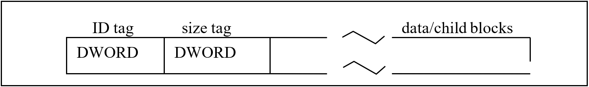
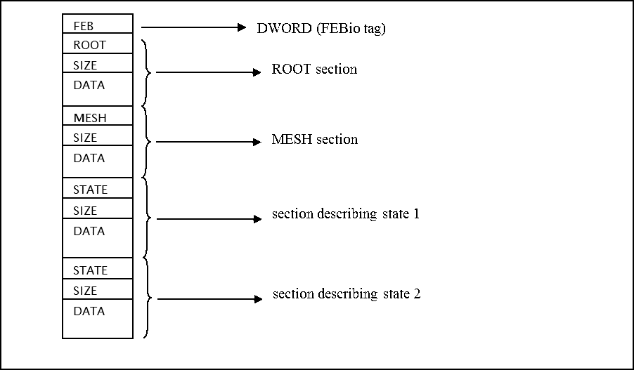

# D.2 Block Structure

## Overview

The FEBio binary database uses an abstract layer to communicate with the file system. This achieves two goals. The first is that the content of a file becomes independent of the file system that wrote the file. Big endian systems can read files created with small endian systems and vice versa. The second goal is that the data is now stored in a hierarchical structure which is easy to search and modify. This means that future additions and changes can be made fairly easily without losing backward compatibility. In addition, the self-describing feature of the format even allows for some forward compatibility.

As mentioned above, the file is structured as a hierarchy of blocks. Each block consists of three fields: a DWORD identifier, followed by a DWORD containing the size of the data chunk in bytes and then the actual data. (A DWORD is a “double word” meaning an unsigned integer of 4 bytes.)

/// figure-caption

Each block in the plot file consists of three fields: a DWORD with an identifier, a DWORD containing the size of the block and finally the data of the block, which can be child blocks.

///

This data may be either numeric data (such as the data of a field variable) or child blocks. If the block has children, it is referred to as a _branch_. If the block only contains numeric data, it is referred to as a _leaf_.

## Parsing the FEBio plot file

Although the FEBio plot file in essence is a hierarchy of blocks as described above, there are a few more caveats that are important for parsing the FEBio file.

The first DWORD of the file is a tag that identifies the FEBio plot file.

| **Tag** | **ID** | **description** |
|---|---|---|
| FEBio | 0x00464542 | FEBio identifier tag |

/// table-caption

The first tag of the plot file is an identifier that can be used to see if the file is indeed an febio plot file.

///

Parsers should read this number and use it to identify whether the file is indeed a proper FEBio plot file. If the value differs, then that means that the file is either not a valid plot file, or that the endianness of the system that wrote the file is different than that of the system that is reading the file. In the latter case, a byte swap will be necessary when reading data from the file.

**_NOTE: Note that the FEBio tag is not followed by a size tag. The reason is that when FEBio is writing the file it does not know the length of the final file yet._**

After the FEBio tag, the content of the file follows, organized in the hierarchical block structure described above. At the highest level, the plot file has a single root block, followed by a mesh block and a series of state blocks.

| **TAG** | **ID** | **description** |
|---|---|---|
| ROOT | 0x01000000 | Root block of FEBio plot file |
| MESH | 0x01040000 | Mesh block containing the mesh definition |
| STATE | 0x02000000 | State block containing results of a single time step |

/// table-caption

The overall structure of the plot file consists of a root section, a mesh section, and multiple state sections.

///

After the root block, the mesh section follows which defines the mesh of the model. Then, at least one state blocks follow. There will be one state block for each time step in the FEBio plot file. Note that these blocks are not child blocks of the root block. In the following figure, the high-level structure of the FEBio plot file is depicted for a file that has two state blocks.

/// figure-caption

Example structure for a plot file containing a root section and two data sections. Each section is composed of three fields. A DWORD containing the section ID, followed by a DWORD containing the size of the section block and finally the actual data (which may be child blocks).

///

As explained above, the first DWORD will be the FEBio identifier. The first block in the file will always be the ROOT block, which will contain the header and dictionary. Then, the mesh section follows, which defines the mesh. After that, the state blocks follow, which will contain the actual results. Each block has three fields. The first field is a DWORD, identifying the section. For the first block, this will be ROOT, for the second block this will be MESH, and for the other blocks this will be STATE. The next DWORD is the size of the entire block. Finally, the actual data will follow, which for the ROOT, MESH and STATE blocks will contain child blocks.
