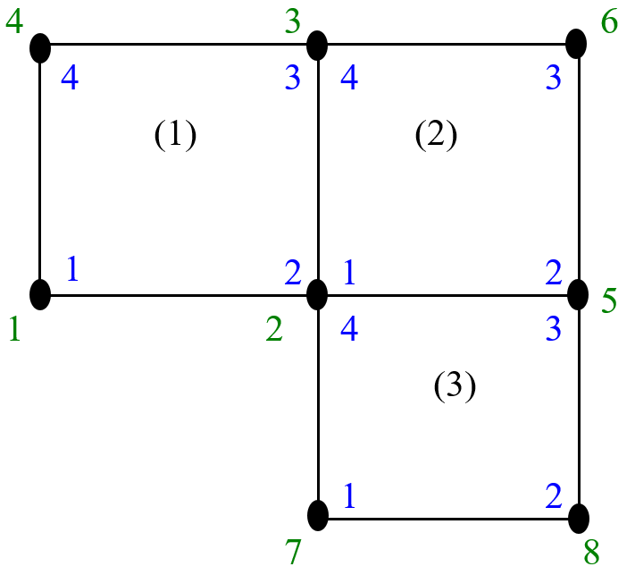

# D.5 State Section

The _state_ section is where all the actual data is stored. FEBio will store one state section for each time step in the analysis. Each state defines two sub-sections, namely the _state header_ and the _state data_.

| **Tag** | **ID** | **description** |
|---|---|---|
| STATE_HEADER | 0x02010000 | state header section |
| STATE_DATA | 0x02020000 | state data section |

/// table-caption

The State section consists of a header and a data section.

///

## State Header

The STATE_HEADER contains the following data field.

| **Tag** | **ID** | **description** | **size** |
|---|---|---|---|
| STATE_TIME | 0x02010002 | time stamp of state | FLOAT |

/// table-caption

The state header section.

///

## State Data Section

The STATE_DATA section stores the data for this state. It is composed of several sub-sections where each section corresponds to a data category as defined in the dictionary. The following sub-sections can thus be defined.

| **Tag** | **ID** | **description** |
|---|---|---|
| GLOBAL_DATA | 0x02020100 | define global data section |
| NODE_DATA | 0x02020300 | define nodal data section |
| DOMAIN_DATA | 0x02020400 | define domain data section |
| SURFACE_DATA | 0x02020500 | define surface data section |

/// table-caption

Each data section is composed of several child sections.

///

**Note that FEBio currently doesn’t write global data sections.**

Each of these sub-sections follows a similar structure. For each of the variables defined in the dictionary corresponding to the data category, a STATE_DATA section is defined.

| **Tag** | **ID** | **description** |
|---|---|---|
| STATE_DATA | 0x02020001 | defines a data section |

/// table-caption

State Data section.

///

Each state data section has two fields.

| **Tag** | **ID** | **description** | **size** |
|---|---|---|---|
| REGION_ID | 0x02020002 | ID of region | DWORD |
| DATA | 0x02020003 | actual data | ? |

/// table-caption

State data sub-sections.

///

The REGION_ID refers to the ID of the region for which this data variable is defined.

It is important to note that for node sets, a value of zero for the REGION_ID refers to the “master” node set which is the set containing all the nodes in the model. This node set is defined implicitly and will not be part of the list of node sets.

The DATA field contains the actual data. The size of this field is variable and is determined by the data type and storage format as defined in the dictionary as well as the number of items in the corresponding region. For example, for a domain that has NE elements, the size of the DATA field, using a type of FLOAT and a storage format of FMT_ITEM will be NE*FLOAT.

When a surface or domain stores its data in the FMT_NODE format, then the parser needs to figure out how many nodes are implicitly defined by the region and what the node order is. An implicit nodeset can be constructed by simple enumeration: each item of the region lists the nodes its visits and no nodes can be visited more than once. So for example, consider the surface of three faces shown in the figure below.

/// figure-caption

Example illustrating enumeration algorithm that defines the node ordering for the implicit node set defined by a surface.

///

Each facet has four nodes. The first four nodes of the implicit node set are simply the four nodes of the first element. The second element skips its first node, since it is already visited, add its second node (which becomes node 5) and its third (node 6) and skips its fourth node. Similarly, the third element adds its second (node 7) and third (node 8) and skips its third and fourth. Thus, this surface defines an implicit node set containing 6 nodes in the order as shown in figure 3. Consequently, if this surface stores its data in FMT_NODE format, then the corresponding data section will contain six values, one for each of the nodes in the implicit node set.
